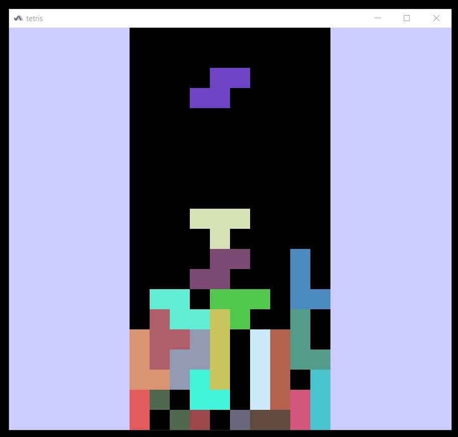

# Tetris

*Степан Остапенко, тестовое задание для проекта **Multiplatform Code Editor***

---



Тетрис для десктопных платформ.

Проект реализован на чистом OpenGL 3.3 в Java (с помощью библиотеки [JOGL](https://ru.wikipedia.org/wiki/Java_OpenGL)).

В игре есть возможность
* двигать фигуры влево/вправо при нажатии на стрелки влево/вправо,
* поворачивать фигуры против часовой стрелки при нажатии на стрелку вверх,
* ускорять падение фигур при нажатии на стрелку вниз.

Также реализовано удаление ряда при заполнении всех его клеток.

Когда какая-то из фигур не влазит на поле, игра заканчивается. Всего в игре есть семь классических видов фигур.

### Запуск

Проект можно запустить с помощью gradle:
```shell
./gradlew run
```

Также можно сначала собрать проект в fat-jar:
```shell
./gradlew build
```
а после этого запустить появившийся в корневой директории файл `tetris.jar`:
```shell
java -jar tetris.jar
```

#### Важно!

Для запуска нужен Oracle OpenJDK 1.8.0 версии >= 331 (именно для Java 8). В противном случае работоспособность не гарантируется.

### Недостатки

К сожалению, сделать пользовательский интерфейс (кнопки, подсчет очков, ...), я не успел, но движок, на мой взгляд, получился неплохой.

SuduIDE я не использовал, т. к. не нашел инструкции для установки на linux.

### Еще

Если интересно, вот мой [проект](https://github.com/stephen-ostapenko/graphics-practice-and-hw/tree/master/proj) с университетского курса по компьютерной графике. Написан на чистом OpenGL 3.3 в C++.